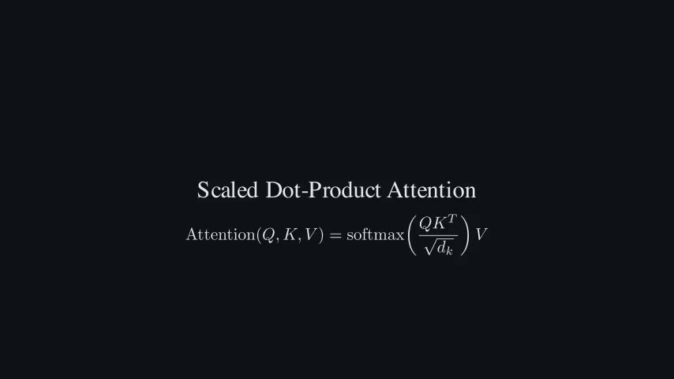
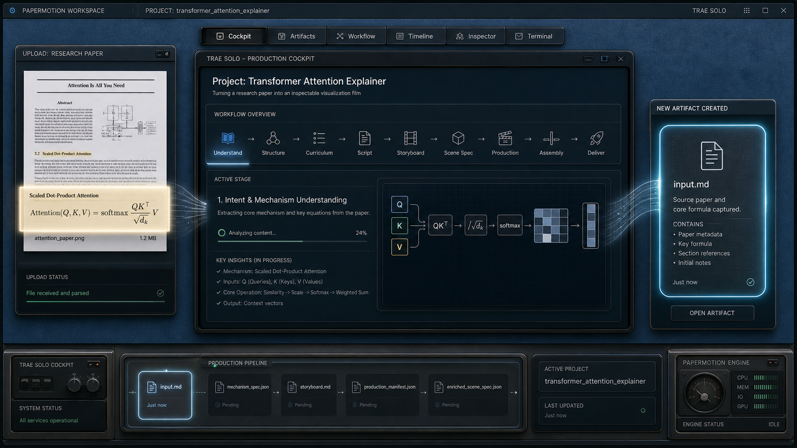
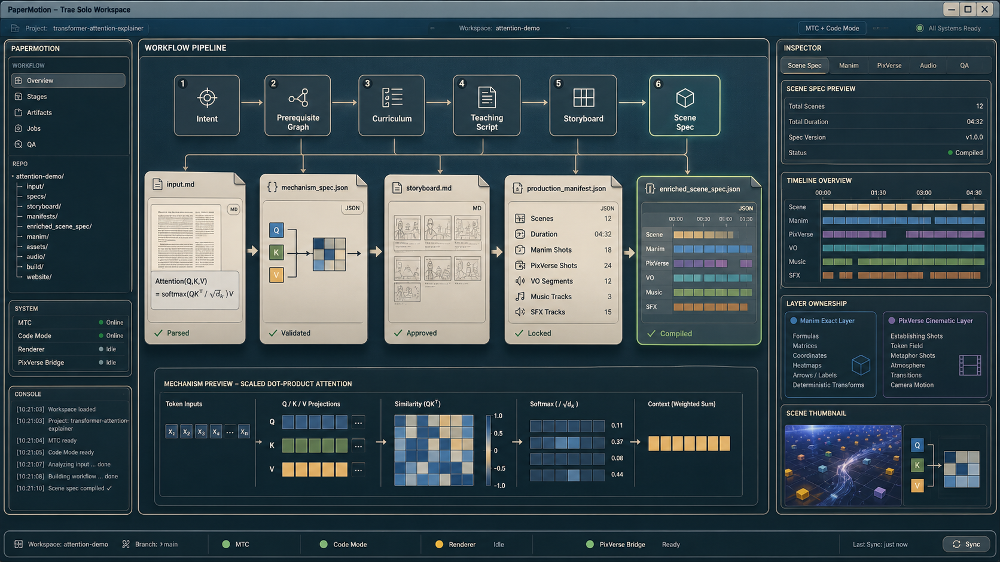
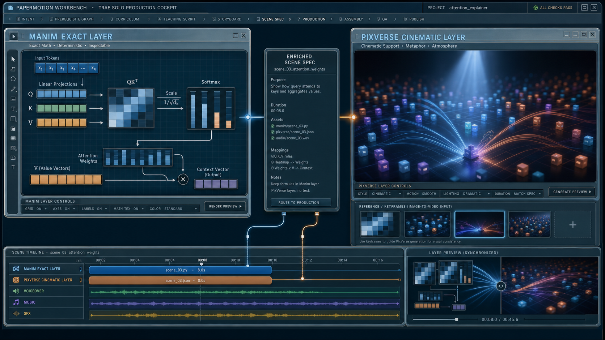
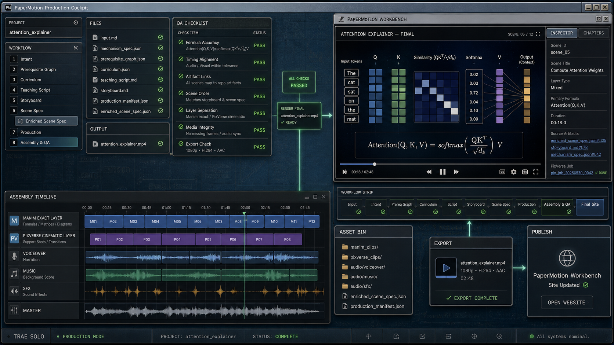
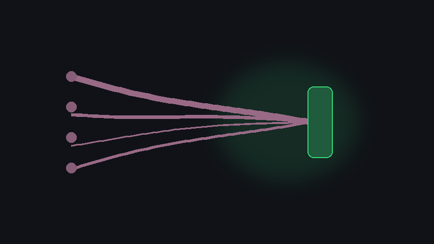

# PaperMotion

PaperMotion 是一个面向科研工作者的 Trae Solo skill pack。它帮助你把论文、公式、算法、证明草图和模型机制，转成可以检查、可以渲染、可以继续修改的科研解释视频工作流。

它的重点不是做一个普通网站，也不是简单把论文总结成文字，而是把“机制如何变成三维动态场景”结构化：

```text
paper / formula -> mechanism spec -> dynamic scene model -> storyboard -> exact render layers -> optional cinematic support -> assembly -> QA
```

## What It Does

PaperMotion 给 Trae Solo 增加三类能力：

1. 论文拆解
   从论文段落、公式、图表或算法里抽取符号、变量、机制步骤、误解风险和可视化边界。

2. 动态视觉建模
   把“这个机制应该怎么动”写成 `dynamic_scene_model.json`，包括视觉对象、三维空间、运动原语、镜头计划、精确层和比喻层边界。

3. 科研视频生成工作流
   把精确公式、矩阵、图结构交给 Manim / Three.js / Blender / Remotion / FFmpeg 等确定性工具；把可选的氛围、转场和非精确镜头交给 AI video provider。

## Demo Preview

点击下图查看 attention 示例视频：

[](site/public/videos/attention-demo.mp4)

视频文件：
[site/public/videos/attention-demo.mp4](site/public/videos/attention-demo.mp4)

## Product Flow

### 1. 上传论文或公式



你可以给 Trae Solo 一篇论文、一个公式、一个算法片段，或者一句类似下面的需求：

```text
请把 scaled dot-product attention 解释成一个 45 秒科研视频。
重点展示 Q/K/V、QK^T、softmax 和 weighted value aggregation。
```

PaperMotion 会把输入变成文件化 artifacts，例如：

```text
examples/<demo>/input.md
examples/<demo>/mechanism_spec.json
examples/<demo>/dynamic_scene_model.json
```

### 2. 生成可检查的文件化流水线



所有关键判断都落在仓库文件里，而不是只留在聊天记录里。这样你可以审查、修改、回滚和复用。

核心文件：

- `input.md`: 论文片段、公式、目标观众、视频目标。
- `mechanism_spec.json`: 符号表、机制步骤、误解风险。
- `dynamic_scene_model.json`: 动态场景模型，定义对象、空间、运动、镜头、exactness policy。
- `storyboard.md`: 场景脚本和讲解节奏。
- `enriched_scene_spec.json`: 可执行的场景级渲染合约。
- `qa_report.md`: 完整生产 run 里的 QA artifact，用来检查来源忠实度、可读性、误解风险和渲染质量。

### 3. 分离精确数学层和 cinematic support



PaperMotion 的核心规则：

- 精确公式、坐标轴、矩阵、图结构、符号标签必须由确定性 renderer 负责。
- AI video provider 只能做非精确的 cinematic support，例如氛围、抽象背景、转场、非文字视觉。
- 3D 不是装饰，必须表达真实机制关系，例如 ray depth、optimization trajectory、token-token relation。

### 4. 组装和 QA



最后阶段会检查：

- 公式是否和论文一致。
- 符号颜色、标签和含义是否稳定。
- 3D 动作是否真的解释机制。
- AI 生成层是否出现假公式、假文字或错误结构。
- 视频是否适合目标观众理解。

## First-Time Use

### Option A: Let Trae Solo install the skill pack

把下面这段发给 Trae Solo：

```text
请把这个 GitHub 仓库作为 PaperMotion skill pack / SKU 安装到本地工作区：

https://github.com/Starryyu77/papermotion.git

请按照仓库里的 prompts/trae-install-sku.md 执行。
```

Trae 应该完成这些动作：

1. Clone 仓库。
2. 读取 `papermotion.sku.json`。
3. 以 `papermotion.sku.json.skills[]` 作为唯一权威 skill 列表。
4. 读取每个 `SKILL.md` 的 frontmatter `name` 和 `description`。
5. 注册或按需加载这些 skills。
6. 确认 root skill 可用：`skills/papermotion-research-video/SKILL.md`。
7. 安装完成后，可选运行 post-install validation：`./setup.sh --check-only`。

安装成功的判断标准不是“跑完 setup”，而是 `skills[]` 里的 skills 已经注册或可加载。

### Option B: Manual local check

```bash
git clone https://github.com/Starryyu77/papermotion.git
cd papermotion
./setup.sh --check-only
```

如果你需要创建本地验证环境：

```bash
./setup.sh
```

如果你要本地渲染 Manim：

```bash
./setup.sh --with-manim
```

## Your First PaperMotion Run

在 Trae Solo 里打开这个仓库，然后粘贴下面的 prompt。明确要求使用
`papermotion-research-video` root skill；它会先路由到
`paper-to-visual-brief` 生成机制简报，再路由到 `dynamic-visual-reasoning`
生成动态场景模型。

```text
使用 PaperMotion 的 papermotion-research-video root skill，把下面公式做成一个科研解释视频：

Attention(Q,K,V)=softmax(QK^T/sqrt(d_k))V

观众：机器学习方向研究生
目标：解释 Q/K/V、score matrix、softmax weights 和 weighted value aggregation
输出：先生成 mechanism_spec.json 和 dynamic_scene_model.json，不要直接写视频代码
```

推荐第一次只生成到 `dynamic_scene_model.json`，先检查“机制怎么变成动态场景”是否正确，再进入 storyboard 和 renderer。

## Available Skills

PaperMotion 的 root skill 是：

```text
skills/papermotion-research-video/SKILL.md
```

当前 skill pack 包含：

| Skill | When To Use |
| --- | --- |
| `papermotion-research-video` | 根 skill，协调完整科研视频工作流 |
| `research-video-orchestrator` | 组织端到端 run，更新任务状态 |
| `paper-to-visual-brief` | 从论文/公式生成 `input.md` 和 `mechanism_spec.json` |
| `dynamic-visual-reasoning` | 生成 `dynamic_scene_model.json` |
| `math-storyboard-director` | 生成 storyboard 和教学节奏 |
| `manim-exact-layer` | 实现精确公式、矩阵、图结构和确定性动画 |
| `ai-cinematic-support` | 生成非精确 cinematic support 规格和提示词 |
| `research-video-qa` | 检查来源忠实度、视觉可读性和误解风险 |

## Examples

更多细节见 [examples/README.md](examples/README.md)。

| Example | Source | What It Tests | Status |
| --- | --- | --- | --- |
| `examples/attention` | Scaled dot-product attention | Q/K/V、score matrix、softmax、weighted value aggregation | Full sample artifacts plus demo video |
| `examples/adam-optimizer` | Adam optimizer paper | noisy gradient、first moment、second moment、adaptive update | Valid dynamic scene model |
| `examples/ddpm-denoising` | DDPM paper | fixed forward noising、closed-form x_t、learned reverse denoising | Valid dynamic scene model |
| `examples/nerf-volume-rendering` | NeRF paper | camera ray、sample points、field query、volume integration | Valid dynamic scene model |

### Attention Keyframes

Token spotlight: 把 attention 解释成“当前 token 在问哪些 token 重要”。


Heatmap cooling: 展示 `QK^T / sqrt(d_k)` 里的 score matrix 和 scale effect。


Value streams: 展示 softmax weights 如何把 value vectors 聚合成 context vector。



Scene layers:

- [s01_tokens_context.webm](site/public/videos/scenes/s01_tokens_context.webm)
- [s02_qkv_roles.webm](site/public/videos/scenes/s02_qkv_roles.webm)
- [s03_similarity_heatmap.webm](site/public/videos/scenes/s03_similarity_heatmap.webm)
- [s04_softmax_weights.webm](site/public/videos/scenes/s04_softmax_weights.webm)
- [s05_weighted_values.webm](site/public/videos/scenes/s05_weighted_values.webm)

## Repository Map

```text
papermotion.sku.json                # skill pack manifest
prompts/trae-install-sku.md         # GitHub-link install prompt for Trae Solo
skills/                             # PaperMotion skill pack
contracts/                          # JSON schemas
examples/                           # sample runs and dynamic scene tests
scripts/validate_dynamic_scene_model.py
setup.sh                            # validation backend wrapper
docs/                               # product direction and design docs
site/                               # optional presentation surface
```

## Validation

Canonical validation:

```bash
./setup.sh --check-only
```

Expected result:

```text
examples/adam-optimizer/dynamic_scene_model.json: valid
examples/attention/dynamic_scene_model.json: valid
examples/ddpm-denoising/dynamic_scene_model.json: valid
examples/nerf-volume-rendering/dynamic_scene_model.json: valid
```

Single-file validation is also available when your active Python can import `jsonschema`:

```bash
python3 scripts/validate_dynamic_scene_model.py examples/attention/dynamic_scene_model.json
```

## What PaperMotion Is Not

- It is not a website-first demo.
- It is not a generic paper summarizer.
- It is not a tool that asks AI video to hallucinate readable equations.
- It is not only static scientific plotting.

PaperMotion is a skill workflow for turning research mechanisms into accurate, inspectable, dynamic visual explanations.
